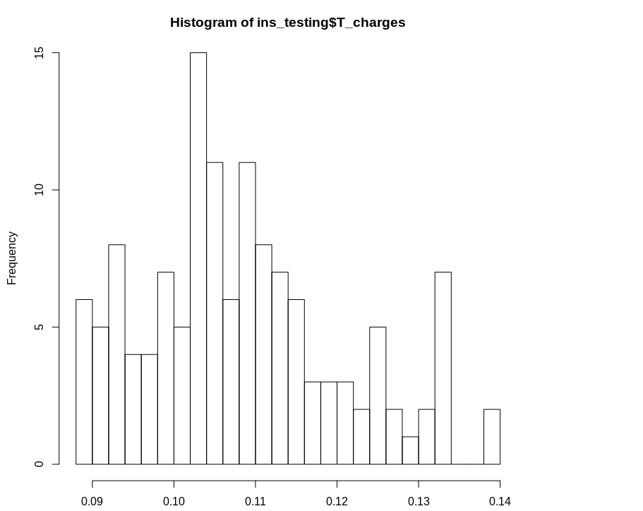
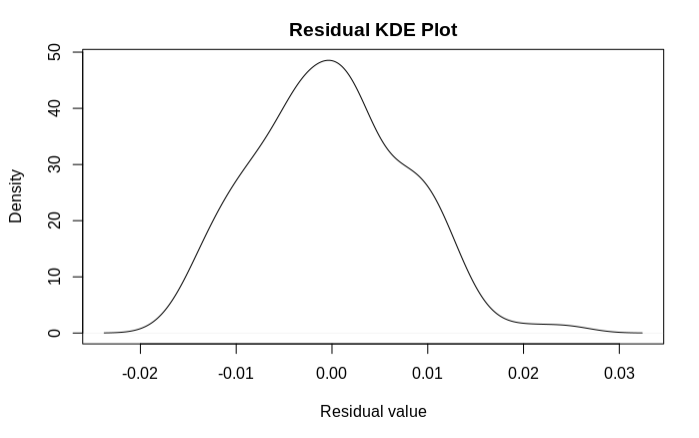

## Our goal 

What is the "Best Fitting Line" for my dataset "insurance.csv"?.  I moved along most of the necessary steps in order to execute a complete and careful finding best fit model workflow.I did a whole changes and transformation to the original data as imported from the "csv". I seperated my dataset for training and testing set. Separating data into training and testing sets is an important part of evaluating models. Typically, when you separate a data set into a training set and testing set, most of the data is used for training, and a smaller portion of the data is used for testing. Analysis Services randomly samples the data to help ensure that the testing and training sets are similar. By using similar data for training and testing, you can minimize the effects of data discrepancies and better understand the characteristics of the model. After a model has been processed by using the training set, you test the model by making predictions against the test set. Because the data in the testing set already contains known values for the attribute that you want to predict, it is easy to determine whether the model's guesses are correct.


The metrics chosen to evaluate the model are very important. Residual Standard Error( RSE), R-Squared , Adjusted R-Squared  , Mean Square Errors (MSE) and Root Mean Squared Errors (RMSE) are very popular metrics for regressors. These metrics are used to measure the performance of making predictions. However, a model fits the data well if the differences between the observed values and the model's predicted values are small and unbiased. Before you look at the statistical measures for goodness-of-fit, you should check the residual plots, for example. Residual plots can reveal unwanted residual patterns that indicate biased results more effectively than numbers. When your residual plots pass muster, you can trust your numerical results and check the goodness-of-fit statistics.  Four principal assumptions justify the use of linear regression models for purposes of inference are :


1. linearity and additivity of the relationship between the dependent and independent variables. (test1)

2. statistical independence of the errors (in particular, no correlation between consecutive errors in the case of time series data) (test2)

3. homoscedasticity (constant variance) of the errors (test3)

4. normality of the error distribution. (test4)

If any of these assumptions is violated (i.e., if there are nonlinear relationships between dependent and independent variables or the errors exhibit correlation, heteroscedasticity, or non-normality), then the forecasts, confidence intervals, and scientific insights yielded by a regression model may be (at best) inefficient or (at worst) incredibly biased or misleadi


## Dataset

This Data is a practical is used in the book Machine Learning with R by Brett Lantz. This book provides an introduction to machine learning using R. All of these datasets are in the public domain but needed some cleaning up and recoding to match the format in the book. The following data obtained from Kaggle explain the cost of a small sample of USA population Medical Insurance Cost based on some attributes :

age: age of the primary beneficiary.
Sex: insurance contractor gender, female, male.
BMI: Body mass index, providing an understanding of the body, weights that are relatively high or low relative to height, objective index of body weight . using the ratio of height to weight, ideally 18.5 to 24.9.
children: Number of children covered by health insurance / Number of dependents.
Smoker: Smoking.
Region: the beneficiary's residential area in the US, northeast, southeast, southwest, northwest.
Charges: Individual medical costs billed by health insurance.

## Our Model 

I suggest a model based on an individual's features such as age, physical/family condition, and location against their existing medical expense  to predict future medical expenses of individuals that help medical insurance decide on charging the premium. I notice that the increase between age and the charges is not linear; the older one gets, an even larger amount of medical expenses is used than a year prior, so a square term of the age,  age2 is added instead to age.


Moreover, realizing that the increase in medical expenses is much higher for smokers than for those with each unit increase of BMI from the previous multiple regression model makes it reasonable to assume that the effect of smoking on medical expenses is a lot more. An obese smoker is spending even more on medical than it was for an individual with obesity or is a smoker alone. Because individual is more proned to getting various healthy related issues when s/he is obese and smoking together. So an interaction term of $bmi30*smoker$ is added. One can observe that the newly added terms,  and , are all significant by p-values, which means that these terms are reasonable to be used in the model. In my model, I used powerTransform and Box-Cox, a family of transformations designed to reduce non-normality of the linear model errors. It turns out that in doing this, it often reduces non-linearity as well. Additionally, this model is fit by weighted least squares using.

## Setup: 
1. Download [R](https://cran.rstudio.com/)
2. Download [R Studio](https://www.rstudio.com/products/rstudio/download/)
 

```{r}
set.seed(89)
knitr::opts_chunk$set(echo = TRUE)
library(ggplot2)
library(dplyr)
library(corrplot)
library(caret)
library(GGally)
library(tree)
library(randomForest)
library(PerformanceAnalytics)
library(psych)
ins=read.csv("insurance.csv")
ins$age2 <- ins$age^2
ins$bmi30 <- ifelse(ins$bmi >= 30, 1, 0)
s_dev=sd(ins$charges)
mean_val=mean(ins$charges)
ins$bmi = scale(ins$bmi)
ins$charges=(ins$charges*s_dev)+mean_val
ins$smoker_num=ifelse(ins$smoker=="yes",1,0)
ins$child_cat = as.factor(ins$children)
head(ins)

```


### Transform the Response

The powerTransform() function in the car package determines the optimal power at which you should raise the outcome variable (in this case, cycles) prior to including it in a linear regression model. The optimal power is denoted by lambda, so $outcome^lambda$ becomes the transformed outcome variable.

```{r}
library(car)

(ans <-powerTransform(cbind(charges,age2) ~ 1, data=ins))
summary(ans)
```


```{r}
ins$T_charges=ins$charges^-0.12
ins$T_age2=ins$age2^.33
ins_training=ins[sample(1:1338,0.90*nrow(ins)),]
ins_testing=ins[sample(1:1338,0.10*nrow(ins)),]
```

```{r,fig.height=8,fig.width=8}
hist(ins_testing$T_charges, breaks = 30)
```



```{r}
linear_model1=lm(T_charges~sex+bmi+child_cat+smoker_num*bmi30+region+T_age2, data=ins_training)
wts <- 1/fitted(lm(abs(ins_training$T_charges-ins_training$pred_ins) ~ predict(linear_model1, ins_training)))^2
WLS_linear_model1 <- lm(T_charges~sex+bmi+child_cat+smoker_num*bmi30+region+T_age2,data=ins_training, weights=wts)
summary(WLS_linear_model1 )
```


```{r}
#RMSE
ins_testing$pred_ins=predict(WLS_linear_model1,ins_testing)
ins_training$pred_ins=predict(WLS_linear_model1,ins_training)
print("RMSE-Training :")
print(RMSE(ins_training$T_charges, ins_training$pred_ins))
print("RMSE-Testing :")
print(RMSE(ins_testing$T_charges, ins_testing$pred_ins))
```


```{r}
#MSE
print("MSE-Training :")
print(mean(ins_training$T_charges-ins_training$pred_ins)^2)
print("MSE-Testing :")
print(mean(ins_testing$T_charges-ins_testing$pred_ins)^2)
```


```{r}
#Residual standard error for training dataset
print("RSE-Training :")

sqrt(sum((predict(WLS_linear_model1, ins_training)-ins_training$T_charges)^2)/
    (nrow(ins_training)-2))

print("RSE-Testing :")

sqrt(sum((predict(WLS_linear_model1, ins_testing)-ins_testing$T_charges)^2)/
    (nrow(ins_testing)-2))

```


```{r}

y=abs(((predict(WLS_linear_model1, ins_testing)-ins_testing$T_charges)^2)/
   (nrow(ins_testing)-2))
x=predict(WLS_linear_model1, ins_testing)
plot(x, y)
abline(lm(y~x), col="purple", lty=2)
loessLine(x,y,col="blue",log.x = FALSE, log.y = FALSE, smoother.args=list())

```


### Non-normality

```{r}
d<-density((((predict(WLS_linear_model1, ins_testing)-ins_testing$T_charges))))
  
plot(d,main='Residual KDE Plot',xlab='Residual value')
```



```{r}
d=(((predict(WLS_linear_model1, ins_testing)-ins_testing$T_charges)))
plot(ecdf(d))
```


```{r}
shapiro.test(d)
```


```{r}
# diagnostic plots
layout(matrix(c(1,2,3,4),2,2)) # optional 4 graphs/page
plot(WLS_linear_model1)
```


### Influential Observations
```{r}
# Influence Plot 
influencePlot(WLS_linear_model1)

```


### Non-independence of Errors

```{r}
# Test for Autocorrelated Errors
durbinWatsonTest(WLS_linear_model1)
```


```{r,fig.height=8,fig.width=8}
hist(ins_testing$pred_ins, breaks = 30)
```


```{r,fig.width=12, fig.height=8}
infIndexPlot(WLS_linear_model1,vars=c("Cook", "Studentized", "Bonf", "hat"),
    id=TRUE, grid=TRUE, main="Diagnostic Plots",col="blue")

```


